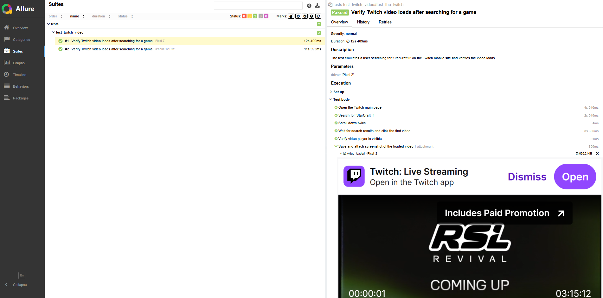

# 📱 Twitch Mobile Automation Testing

Automated UI test suite for the **Twitch mobile website** using **Selenium**, **pytest**, and **Allure Reports**, with **mobile emulation** for devices like Pixel 2 and iPhone 12 Pro.

This test validates that users can search for a game (e.g., _StarCraft II_) and successfully play one of the resulting videos — simulating real mobile user behavior.

---

## 🎥 Test in Action

> _👇 The test runs locally with mobile emulation:_
  


---

## 🚀 How to Run the Tests

### 📦 Prerequisites

- Python 3.8+
- Google Chrome installed
- [ChromeDriver](https://sites.google.com/a/chromium.org/chromedriver/) compatible with your Chrome version
- [Allure Commandline](https://docs.qameta.io/allure/#_installing_a_commandline)

### 🛠 Installation

1. **Clone the repository**:

```bash
git clone https://github.com/your-username/twitch-mobile-tests.git
cd twitch-mobile-tests
```

2. **Create a virtual environment** (optional but recommended):

```bash
python -m venv venv
source venv/bin/activate  # or `venv\Scripts\activate` on Windows
```

3. **Install dependencies**:

```bash
pip install -r requirements.txt
```

### ▶️ Run the Tests

```bash
pytest --alluredir=allure-results
```

### 📊 View Allure Report

```bash
allure serve allure-results
```

This will open a browser window with the rich Allure UI.
---
### 🖼️ Allure Report Example

Below is an example of a detailed Allure report generated by the test suite.

✅ Each test run is clearly **parameterized by device** (`Pixel 2`, `iPhone 12 Pro`)  
✅ Steps are automatically **annotated using `allure.step()`** for readable test flow  
✅ A **device-specific screenshot** is saved and attached as an Allure artifact  
✅ Test execution time for each step is captured and displayed  
✅ The report is fully compatible with CI pipelines or local runs



---

## ⚙️ Optional: Run in Headless Mode

To speed up test execution or run tests in environments without a GUI (e.g., CI pipelines), you can enable **headless mode** for Chrome by uncommenting the following line in `conftest.py`:

```python
# chrome_options.add_argument("--headless=new")
```

> 💡 `--headless=new` uses Chrome’s newer, more stable headless mode introduced in recent versions.  
> 📌 Note: Visual elements like screenshots may differ slightly from non-headless mode.

---

## 🧱 Project Structure

```
twitch-mobile-tests/
│
├── conftest.py                  # Fixtures for driver & page objects
├── requirements.txt             # Python dependencies
├── tests/
│   └── test_twitch_video.py     # Main test scenario
│
├── pages/
│   ├── base_page.py             # Shared utilities for all pages
│   ├── main_page.py             # Handles search functionality
│   ├── result_page.py           # Handles video result interaction
│   └── opened_video_page.py     # Verifies that video is playing
│
├── twitch_locators.py           # Centralized element locators
├── screenshots/                 # Auto-generated screenshots (ignored in Git)
└── assets/                      # Static media (e.g., GIF used in README)
    └── twitch_run.gif
```

📝 _Note: Screenshots are saved per device (e.g., `video_loaded_pixel_2.png`) and attached to Allure reports._  
🖼️ _The `assets/` folder stores static visuals like the demo GIF used in the README._

---

## 📋 Test Scenario Overview

This test uses `@pytest.mark.parametrize` to run the same flow on **multiple mobile devices**:  
📱 `Pixel 2` and 📱 `iPhone 12 Pro`

1. **Open** the Twitch mobile homepage  
2. **Search** for the game _"StarCraft II"_  
3. **Scroll** through the results  
4. **Click** on an available video result  
5. **Handle** the mature content warning if shown  
6. **Verify** that the video player is visible  
7. **Capture** and attach a **device-specific** screenshot to the Allure report  

---

## 🛠 Tech Stack

- 🐍 **Python** + `pytest`  
- 🌐 **Selenium** WebDriver with mobile emulation  
- 📱 **Chrome DevTools** emulation for Pixel 2 & iPhone 12 Pro  
- 📊 **Allure Reports** for rich, step-by-step test documentation  

---

## 📄 Notes

📁 _The `screenshots/` folder is auto-created and should be added to `.gitignore` to avoid cluttering the repository._

